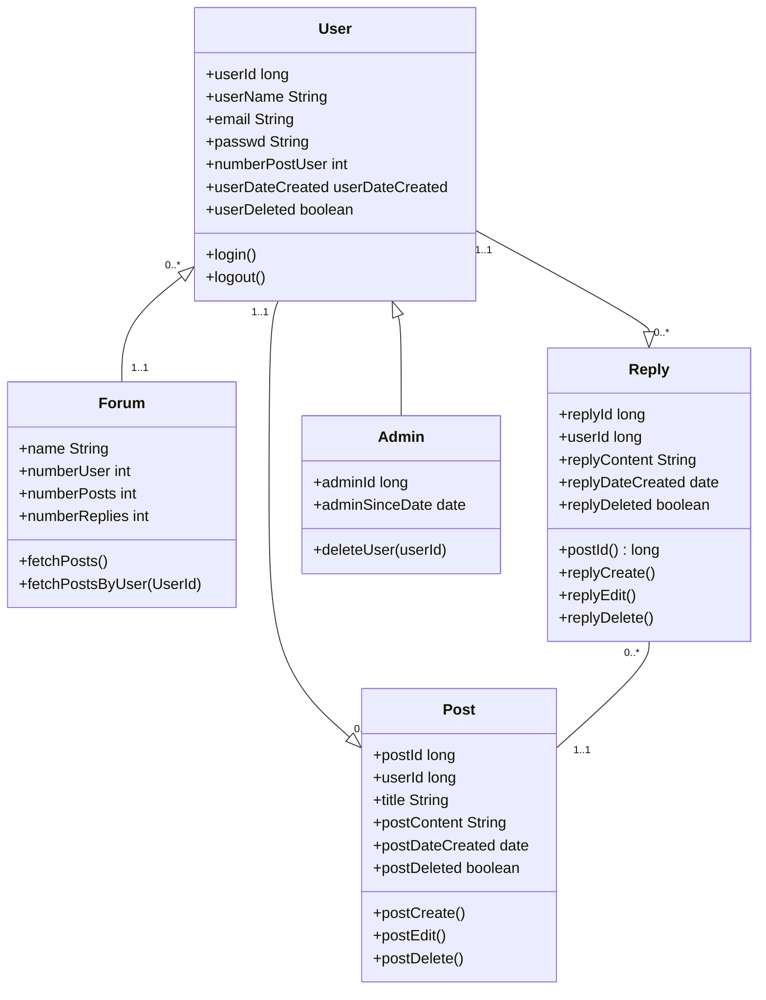

# Schnack_Documentation
Documentation of the project (UML etc.)

## UML

```mermaid
classDiagram
    User "0..*" <|-- "1..1" Forum
    User "1..1" --|> "0..*" Post
    User "1..1" --|> "0..*" Reply
    User  <|--  Admin
    Reply "0..*" -- "1..1" Post

    User : +userId long
    User : +userName String
    User : +email String
    User : +passwd String
    User : +numberPostUser int
    User : +userDateCreated userDateCreated
    User : +userDeleted boolean
    User: +login()
    User: +logout()

    class Forum{
      +name String
      +numberUser int
      +numberPosts int
      +numberReplies int
      +fetchPosts()
      +fetchPostsByUser(UserId)
    }

    class Post{
      +postId long
      +userId long
      +title String
      +postContent String
      +postDateCreated date
      +postDeleted boolean
      +postCreate()
      +postEdit()
      +postDelete()
    }

    class Admin{
      +adminId long
      +adminSinceDate date
      +deleteUser(userId)
    }

    class Reply{
      +replyId long
      +userId long
      +postId() long
      +replyContent String
      +replyDateCreated date
      +replyDeleted boolean
      +replyCreate()
      +replyEdit()
      +replyDelete()
    }
```

Read more about [Mermaid's Syntax](https://mermaid.js.org/syntax/classDiagram.html)

[Online Editor](https://mermaid.live)

